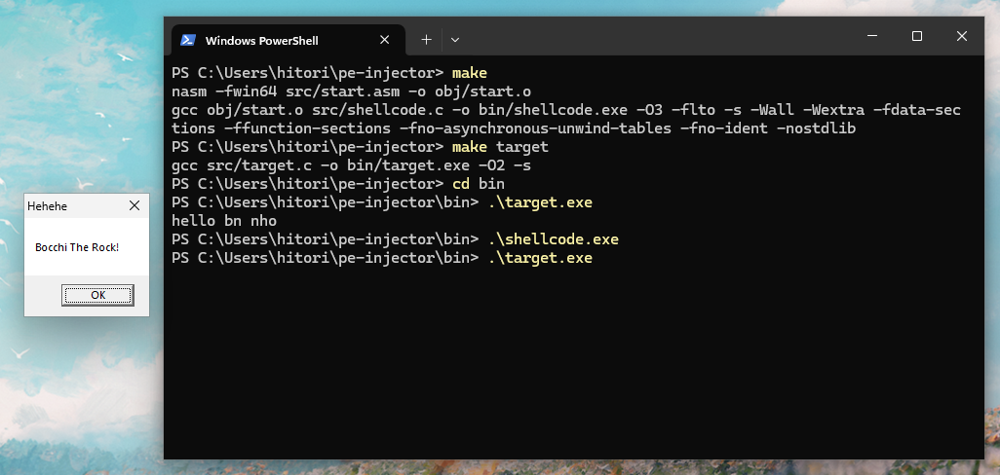

# pe-injection

```c
#include <disclaimer.h>
/*  Simple malware that performs PE Injection.
    This is my smol project for learning about PE files (may have some 🐞).
    Becareful! It will destroy your executables. */
```



# usage


```bash
git clone https://github.com/hitori1403/pe-injector.git
cd pe-injector
make
```

It will produce a file called `shellcode.exe`. Use it carefully!

Take a quick look at `Makefile` for more details.

# functions

- [x] Inject itself into others PE files in the same directory
- [x] TLS Injection
- [x] Patch `PEHeader.AddressOfEntryPoint` if TLS Injection fails
- [ ] IAT Patching (needs more time)

# references

- [From a C project, through assembly, to shellcode](https://vxug.fakedoma.in/papers/VXUG/Exclusive/FromaCprojectthroughassemblytoshellcodeHasherezade.pdf)
- [Executing Position Independent Shellcode from Object Files in Memory](https://bruteratel.com/research/feature-update/2021/01/30/OBJEXEC/)
- [sakeInject - TLS (Thread Local Storage) Injector in C/C++](https://github.com/aaaddress1/sakeInject/)
- [Malware - IAT Hooking](https://trikkss.github.io/posts/iat_hooking/)
- [Injecting Code using Imported Functions into Native PE Files](https://blog.washi.dev/posts/import-patching/)
